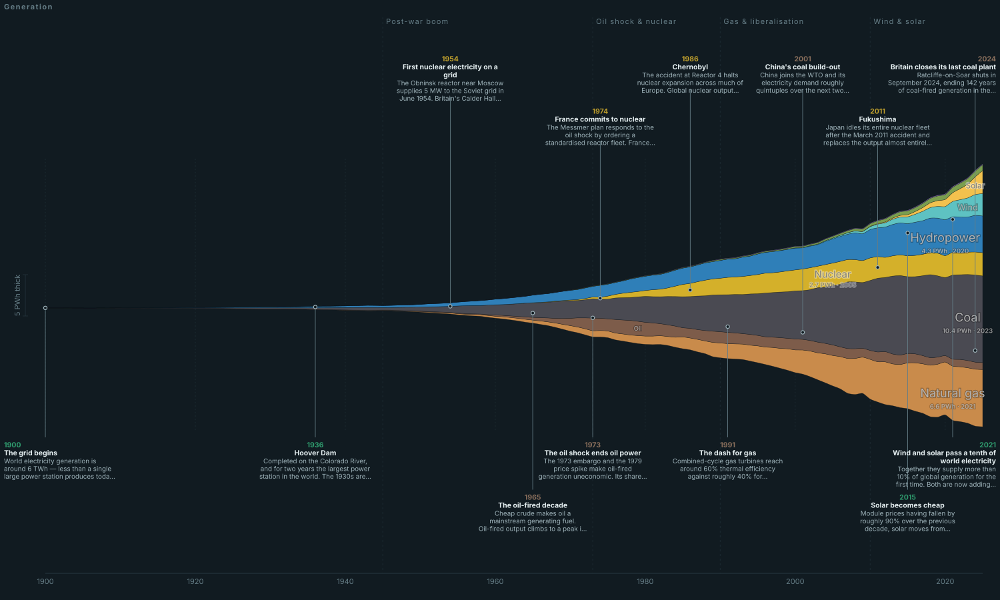

# Two streamgraphs

A single-page site with two tabs, both drawn by the same dependency-free streamgraph engine:

| | | |
|---|---|---|
| **01** | **Where gaming's money went** | Worldwide video game revenue, 1970–2026, drillable from platform segment → company → individual console, splittable across seven world regions. |
| **02** | **Where our electricity comes from** | World and national electricity generation by source, 1900–2025, drillable from fossil/nuclear/renewable → fuel → specific fuel, with a switch from terawatt-hours to carbon footprint. |

The two tabs share their interactions and chart shapes but not their look — the electricity tab
is a cooler, more instrument-like surface, because it is a different kind of thing.

> [!IMPORTANT]
> **This project was researched, modelled and written by an AI system** (Claude), working from
> public sources. No human analyst has audited the figures. AI systems can and do state wrong
> numbers confidently. Every worldwide total here is tied to a named source and the regional
> model is automatically re-checked against eleven independently published figures on every
> build — but those are mitigations, not guarantees. Treat this as a well-sourced sketch of the
> shape of the industry, not as a citable dataset. If a specific number matters to you, check
> the primary source in [`research/RESEARCH-NOTES.md`](research/RESEARCH-NOTES.md) first.

**Open `index.html`.** It works from a plain double-click — no build step, no server, no
dependencies, no network access at runtime. (`node serve.mjs` starts a local server on port
8123 if you'd rather.)




---

## What you can do with it

| | |
|---|---|
| **Drill down** | Click any band. A segment breaks into companies; a company breaks into individual platforms. `Console → Sony → PlayStation 1…5` is two clicks. Clicking empty space (or <kbd>Esc</kbd>) clears the selection first, so everything returns to full colour; clicking again collapses. |
| **Split by region / country** | Gaming: seven world regions — North America is the only one where console outsells mobile, and Japan's arcade band is larger than every other region's combined. Electricity: the World plus 21 countries and the EU. |
| **Carbon footprint** | On the electricity tab, switch the measure from TWh to CO₂ and every band is multiplied by its emission factor. Two bases: full lifecycle (IPCC AR5) where wind, solar and nuclear are small but non-zero, or combustion only, where they are zero. Watching coal stay the same height while hydro and nuclear collapse is the point of the feature. |
| **Hide segments** | The eye icon in the legend removes a segment from the chart *entirely* — it stops counting towards the total and towards Share percentages. Useful for looking at console on its own. |
| **Shape** | Stream (the flowing, widens-both-ways look), Centred, Stacked with a real y-axis, or Share as a 100% band. |
| **Zoom** | Scroll over the chart to narrow or widen the time frame, anchored on the year under your cursor. Or drag the two sliders. Zooming in reveals more story notes and longer text. |
| **Dollars** | Real 2025 dollars (the default — see below) or nominal. |
| **Story notes** | 50 annotated moments; ~24 fit at desktop width. Click one to read the full text. |
| **Detail panel** | Selecting a band shows launch date, launch price, lifetime hardware and software units, peak year, and key titles. |
| **Theme** | Dark by default, light available in the toolbar. |

**Why real dollars by default:** in nominal terms the 1982 arcade peak is about 4% of the 2026
total and vanishes into a hairline. Inflation-adjusting is the only way to see 56 years on one
linear scale.

**Why there is no quarterly view any more:** an earlier version had one. It was removed because
no public quarterly series exists for this industry before roughly 2010, so every quarterly
value was one fixed seasonality assumption repeated fifty-seven times. It produced a regular
sawtooth that looked like a measurement and was not.

---

## What's being counted

Worldwide **consumer** spending: coin dropped into arcade machines, software bought at retail
or digitally, DLC, subscriptions, in-app purchases. No B2B revenue (cabinet sales to operators,
engine licences, advertising, sponsorship) — counting that alongside player spending would
double-count the same dollar.

**Dedicated games hardware is included** (consoles, handhelds, VR headsets); general-purpose
hardware is not (gaming PCs, GPUs, phones). That's why 2024 reads as ~$207bn here against
Newzoo's widely-quoted $182.7bn — Newzoo counts content only, and about $15bn of the gap is
console and handheld hardware.

Each segment is cut the only way it *can* be cut without double-counting:

- **Console / handheld** — by platform holder. A band is all money spent on that ecosystem, from
  every publisher. The PlayStation 4 band includes Call of Duty.
- **PC** — by **storefront**. An EA game bought on Steam is Steam revenue.
- **Mobile** — by publisher (each game has exactly one).
- **Arcade** — by the manufacturer of the machine that took the coin.
- **VR / Cloud** — by platform owner.

---

## Electricity: what makes it different

**The generation numbers are not modelled.** They are ingested verbatim from Our World in Data's
*Electricity production by source* (which merges Ember, the Energy Institute Statistical Review
and historical estimates back to 1900), with fuel-level detail from Eurostat. A trimmed copy of
both is committed in `data/source/`, so every band traces to a source file.

**The coal breakdown is real, and that is why it isn't everywhere.** Clicking coal opens it into
lignite, other bituminous, sub-bituminous, coking coal and anthracite — for the EU, Germany,
Poland, Czechia, France, Spain, Italy, the Netherlands and Greece, because Eurostat publishes
that split. **No global agency publishes electricity generation by coal rank**, so for the World,
the United States or China the app simply does not offer the drill-down rather than inventing it.

**Coverage is per country and honest about it.** The upstream data carries renewables back to
1965 but fossil fuels only from 1985. Charting the full available range would show Germany in
1970 as nuclear and hydro alone — a spotlessly clean grid that never existed. So coverage is
defined as the range with a *complete* fuel mix: 1900 for the World, 1920 for the UK, 1985 or
1990 for everyone else, and the year slider clamps accordingly.

**A mistake the validation caught.** The first version used the IPCC's *direct emissions* column
for the combustion basis, and the modelled carbon intensity came out ~22% below Ember's published
figure for essentially every country and year. That column describes a modern reference plant;
the real fleet is older. Fitting the factors by least squares across 672 published country-year
intensities gives coal 931, oil 773, gas 593 and bioenergy ≈ 0 gCO₂/kWh — values that sit inside
independently published fleet averages, with the bioenergy result independently confirming that
biogenic carbon is treated as neutral. 81 of 88 checks now pass; the seven that don't are
CHP-heavy or hydro-dominated grids, and they are listed in the notes rather than tuned away.

---

## Honest limitations

- **Regional splits are modelled, not measured.** Worldwide segment totals are researched.
  Their split between regions is anchored on published regional revenue where it exists
  (Newzoo by region from 2021, CNG/GPC for China, ISFE for Europe) and reconstructed from
  unit-sales geography before that. Company-level regional mixes use affinity multipliers
  derived from published regional hardware splits. There is no per-platform-per-region source
  data anywhere, so "PlayStation 2 in Latin America" is a model output, not a measurement.
- **The regional model is checked automatically.** `node data/build.mjs` compares its output
  against eleven independently published regional figures on every run and prints the gap for
  each. All eleven currently pass, most within 8%.
- **Pre-1985 figures and arcade figures after 1990 are the least certain numbers here.** Sources
  disagree by a factor of two on 1982 US arcade coin drop alone ($4.3bn vs $7.7bn).
- **Newzoo restated its methodology in 2024–25**; two vintages disagree by ~$10bn on the same
  year. This project uses the 2025 vintage from 2020 on and splices earlier years.
- **2026 is a forecast** in every segment.
- Mobile's "Others" band is genuinely about half the segment. Even after naming the nineteen
  largest publishers, mobile is that long-tailed.
- The arcade band deliberately survives past 1990, unlike most published versions of this chart.
  Those show arcade collapsing to nothing after the mid-1980s, which is true of the United
  States and not of Japan, where arcade *operating* revenue was a multi-billion-dollar business
  well into the 2010s.

**Electricity tab:**

- **Wind is not split into onshore and offshore.** Eurostat has a single wind code; IRENA
  publishes the split for capacity, not generation. Left out rather than approximated.
- **Emission factors are constant over time**, so the carbon view slightly understates historical
  emissions and overstates modern ones. A 2024 ultra-supercritical coal unit and a 1970s
  subcritical one differ by well over 20% per kWh and are treated identically here.
- **Generation is not consumption.** Transmission losses, plant own-use and net imports are
  excluded, so a country's bands do not equal what its population used.
- On the combustion basis bioenergy counts as zero, following the standard convention. That
  convention is contested; the lifecycle basis (230 gCO₂e/kWh) is the better one to look at if
  it concerns you.

---

## Publishing it on GitHub Pages

The repo is a static site with no build output required at serve time, so Pages needs almost
nothing:

```bash
git init && git add -A && git commit -m "Where gaming's money went"
```

Push it to a new GitHub repo, then in **Settings → Pages → Build and deployment**, set
**Source** to **GitHub Actions**. The included workflow (`.github/workflows/pages.yml`) then
runs on every push to `main`: it re-runs `node data/build.mjs`, fails the build if the committed
dataset has drifted from the source data modules, and deploys.

If you'd rather not use Actions at all, setting Pages to "Deploy from a branch → main → / (root)"
also works — `index.html` is at the repo root and everything it loads is a relative path.

**What is deliberately not committed:** `research/sources/` is git-ignored. Those are
third-party PDFs (Newzoo reports, Nintendo investor filings) and wiki exports downloaded during
research; redistributing them isn't mine to do, and they'd add ~14 MB. Every source URL is in
`research/RESEARCH-NOTES.md`.

### Security posture

The page makes **no network requests at runtime** — no CDN, no fonts, no analytics, no
telemetry. It reads no cookies and writes no storage. The only external identifier anywhere in
the shipped code is the SVG XML namespace URI, which is not fetched. There is no `eval`, no
`new Function`, no `innerHTML` fed from user input; the handful of `innerHTML` sites interpolate
only values from the local data files, HTML-escaped, with colours validated against a hex
pattern. `serve.mjs` is a development convenience only, binds to the default interface on port
8123, and refuses to serve paths outside the project directory.

---

## Layout

```
index.html                  the app
css/style.css               styling (dark + light)
js/stream.js                streamgraph maths — stacking, inside-out ordering,
                            spline area paths, colour blending. No dependencies.
js/app.js                   state, rendering, drill-down, notes, tooltips
serve.mjs                   optional local static server
snapshot.svg                static export of the default view (not used by the app)

data/energy-sources.mjs     ← RESEARCH: fuel hierarchy, emission factors, entity list
data/energy-descriptions.mjs ← RESEARCH: prose for every fuel, sub-fuel and country
data/energy-events.mjs      ← RESEARCH: electricity milestones
data/source/*.csv           committed upstream data (OWID, Eurostat) — the build reads these
data/stage-energy-sources.mjs  trims the big downloads into data/source/
data/build-energy.mjs       source CSVs → data/energy.{json,js}, with validation

data/segments.mjs           ← RESEARCH: annual segment totals, CPI
data/platforms.mjs          ← RESEARCH: every platform, company and revenue series
data/regions.mjs            ← RESEARCH: regional shares, company affinity, validation checks
data/descriptions.mjs       ← RESEARCH: reference prose for every segment, company and region
data/events.mjs             ← RESEARCH: the 50 story notes
data/build.mjs              model → data/gaming-revenue.{json,js}
data/gaming-revenue.js      generated; loaded by index.html
data/gaming-revenue.json    generated; same data, for use elsewhere

research/RESEARCH-NOTES.md  full sourcing, with the numbers each figure came from
research/pdftext.js         minimal PDF text extractor used during research
research/sources/           downloaded primary sources (git-ignored)
```

**To change any number, edit the files in `data/` marked RESEARCH and re-run:**

```bash
node data/build.mjs        # gaming
node data/build-energy.mjs # electricity
```

The build prints a summary table and warns if any segment's named bands exceed its researched
total.

---

## How the model works

1. **Segment totals are the spine** and are researched directly — Play Meter and Vending Times
   arcade surveys for the 1970s–80s, Gaming Alexandria's compilation of contemporaneous trade
   estimates for US retail 1972–1999, Capcom/Sega Sammy/JAMMA filings for Japanese arcades,
   DFC Intelligence for PC, Newzoo and Sensor Tower and company filings from 2012 on.

2. **Console and handheld bands are derived, not guessed.** Revenue comes from published
   shipment curves:

   ```
   revenue(y) = units(y) × hardwarePrice(y)
              + softwareUnits(y) × softwarePrice × liveServiceFactor(y)
   ```

   where `softwareUnits(y)` distributes the platform's lifetime software total across years in
   proportion to its active installed base — so software keeps earning for years after hardware
   peaks, which is what actually happens. `liveServiceFactor` rises from 1.0 before 2003 to 1.85
   from 2018, capturing DLC and microtransactions that unit sales miss.

3. **Every band is then rescaled** so each segment-year sums exactly to the researched total.
   Platform detail sets the *shape*; the research sets the *level*.

4. **"Others" bands are residuals** — segment total minus everything named — so they are exact
   by construction rather than estimated.

5. **Regions are applied last.** Each segment's worldwide total is split by researched regional
   shares, then redistributed within the region by company affinity multipliers and
   renormalised, so every region's bands still sum to that region's share of the segment. The
   sum of all seven regions equals the worldwide figure to within $0.03M across all 57 years.

Sources for every figure are in `research/RESEARCH-NOTES.md`.

---

## Licence

Code is MIT (see `LICENSE`). The revenue figures are estimates compiled from public sources and
carry no endorsement from the firms cited or the companies charted.
