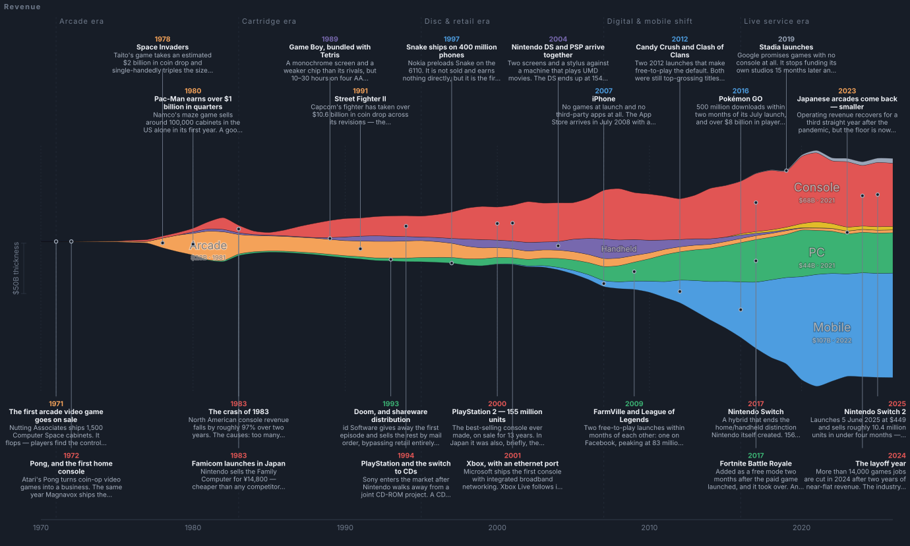

# Where Gaming's Money Went — 1970–2026

An interactive streamgraph of worldwide consumer spending on video games, every quarter from
1970 to 2026, drillable from platform segment down to individual console.

**Open `index.html`.** It works from a plain double-click — no build step, no server, no
dependencies, no network access at runtime. (`node serve.mjs` starts a local server on port
8123 if you'd rather.)



---

## What you can do with it

| | |
|---|---|
| **Drill down** | Click any band. A segment breaks into companies; a company breaks into individual platforms. `Console → Sony → PlayStation 1…5` is two clicks. Click empty space, or press <kbd>Esc</kbd>, to close everything. |
| **Hide segments** | The eye icon in the legend removes a segment from the chart *entirely* — it stops counting towards the total and towards Share percentages. Useful for looking at console on its own. |
| **Shape** | Stream (the flowing, widens-both-ways look), Centred, Stacked with a real y-axis, or Share as a 100% band. |
| **Zoom** | Scroll over the chart to narrow or widen the time frame, anchored on the year under your cursor. Or drag the two sliders. Zooming in reveals more story notes and longer text. |
| **Resolution** | Annual, or all 228 quarters. |
| **Dollars** | Real 2025 dollars (the default — see below) or nominal. |
| **Story notes** | 50 annotated moments; ~24 fit at desktop width. Click one to read the full text. |
| **Detail panel** | Selecting a band shows launch date, launch price, lifetime hardware and software units, peak year, and key titles. |
| **Theme** | Dark by default, light available in the toolbar. |

**Why real dollars by default:** in nominal terms the 1982 arcade peak is about 4% of the 2026
total and vanishes into a hairline. Inflation-adjusting is the only way to see 56 years on one
linear scale.

**Why the quarterly view has a regular sawtooth:** because seasonality is modelled, not
measured — see the limitations below.

---

## What's being counted

Worldwide **consumer** spending: coin dropped into arcade machines, software bought at retail
or digitally, DLC, subscriptions, in-app purchases. No B2B revenue (cabinet sales to operators,
engine licences, advertising, sponsorship) — counting that alongside player spending would
double-count the same dollar.

**Dedicated games hardware is included** (consoles, handhelds, VR headsets); general-purpose
hardware is not (gaming PCs, GPUs, phones). That's why 2024 reads as ~$207bn here against
Newzoo's widely-quoted $182.7bn — Newzoo counts content only, and about $15bn of the gap is
console and handheld hardware.

Each segment is cut the only way it *can* be cut without double-counting:

- **Console / handheld** — by platform holder. A band is all money spent on that ecosystem, from
  every publisher. The PlayStation 4 band includes Call of Duty.
- **PC** — by **storefront**. An EA game bought on Steam is Steam revenue.
- **Mobile** — by publisher (each game has exactly one).
- **Arcade** — by the manufacturer of the machine that took the coin.
- **VR / Cloud** — by platform owner.

---

## Honest limitations

- **Quarterly values are modelled, not measured.** No public quarterly series exists for this
  industry before roughly 2010, and none at all for arcades or pre-1995 console markets. Annual
  totals are distributed using segment- and era-specific seasonality (holiday-heavy for
  retail-era consoles, nearly flat for mobile and subscriptions), with launch quarters handled
  explicitly so the PS5 contributes nothing before Q4 2020. That fixed seasonality is exactly
  why quarterly mode has a regular sawtooth. **Use the annual view for anything that matters.**
- **Pre-1985 figures and arcade figures after 1990 are the least certain numbers here.** Sources
  disagree by a factor of two on 1982 US arcade coin drop alone ($4.3bn vs $7.7bn).
- **Newzoo restated its methodology in 2024–25**; two vintages disagree by ~$10bn on the same
  year. This project uses the 2025 vintage from 2020 on and splices earlier years.
- **2026 is a forecast** in every segment.
- Mobile's "Others" band is genuinely about half the segment. Even after naming the nineteen
  largest publishers, mobile is that long-tailed.
- The arcade band deliberately survives past 1990, unlike most published versions of this chart.
  Those show arcade collapsing to nothing after the mid-1980s, which is true of the United
  States and not of Japan, where arcade *operating* revenue was a multi-billion-dollar business
  well into the 2010s.

---

## Publishing it on GitHub Pages

The repo is a static site with no build output required at serve time, so Pages needs almost
nothing:

```bash
git init && git add -A && git commit -m "Where gaming's money went"
```

Push it to a new GitHub repo, then in **Settings → Pages → Build and deployment**, set
**Source** to **GitHub Actions**. The included workflow (`.github/workflows/pages.yml`) then
runs on every push to `main`: it re-runs `node data/build.mjs`, fails the build if the committed
dataset has drifted from the source data modules, and deploys.

If you'd rather not use Actions at all, setting Pages to "Deploy from a branch → main → / (root)"
also works — `index.html` is at the repo root and everything it loads is a relative path.

**What is deliberately not committed:** `research/sources/` is git-ignored. Those are
third-party PDFs (Newzoo reports, Nintendo investor filings) and wiki exports downloaded during
research; redistributing them isn't mine to do, and they'd add ~14 MB. Every source URL is in
`research/RESEARCH-NOTES.md`.

### Security posture

The page makes **no network requests at runtime** — no CDN, no fonts, no analytics, no
telemetry. It reads no cookies and writes no storage. The only external identifier anywhere in
the shipped code is the SVG XML namespace URI, which is not fetched. There is no `eval`, no
`new Function`, no `innerHTML` fed from user input; the handful of `innerHTML` sites interpolate
only values from the local data files, HTML-escaped, with colours validated against a hex
pattern. `serve.mjs` is a development convenience only, binds to the default interface on port
8123, and refuses to serve paths outside the project directory.

---

## Layout

```
index.html                  the app
css/style.css               styling (dark + light)
js/stream.js                streamgraph maths — stacking, inside-out ordering,
                            spline area paths, colour blending. No dependencies.
js/app.js                   state, rendering, drill-down, notes, tooltips
serve.mjs                   optional local static server
snapshot.svg                static export of the default view (not used by the app)

data/segments.mjs           ← RESEARCH: annual segment totals, seasonality, CPI
data/platforms.mjs          ← RESEARCH: every platform, company and revenue series
data/events.mjs             ← RESEARCH: the 50 story notes
data/build.mjs              model → data/gaming-revenue.{json,js}
data/gaming-revenue.js      generated; loaded by index.html
data/gaming-revenue.json    generated; same data, for use elsewhere

research/RESEARCH-NOTES.md  full sourcing, with the numbers each figure came from
research/pdftext.js         minimal PDF text extractor used during research
research/sources/           downloaded primary sources (git-ignored)
```

**To change any number, edit the three files in `data/` marked RESEARCH and re-run:**

```bash
node data/build.mjs
```

The build prints a summary table and warns if any segment's named bands exceed its researched
total.

---

## How the model works

1. **Segment totals are the spine** and are researched directly — Play Meter and Vending Times
   arcade surveys for the 1970s–80s, Gaming Alexandria's compilation of contemporaneous trade
   estimates for US retail 1972–1999, Capcom/Sega Sammy/JAMMA filings for Japanese arcades,
   DFC Intelligence for PC, Newzoo and Sensor Tower and company filings from 2012 on.

2. **Console and handheld bands are derived, not guessed.** Revenue comes from published
   shipment curves:

   ```
   revenue(y) = units(y) × hardwarePrice(y)
              + softwareUnits(y) × softwarePrice × liveServiceFactor(y)
   ```

   where `softwareUnits(y)` distributes the platform's lifetime software total across years in
   proportion to its active installed base — so software keeps earning for years after hardware
   peaks, which is what actually happens. `liveServiceFactor` rises from 1.0 before 2003 to 1.85
   from 2018, capturing DLC and microtransactions that unit sales miss.

3. **Every band is then rescaled** so each segment-year sums exactly to the researched total.
   Platform detail sets the *shape*; the research sets the *level*.

4. **"Others" bands are residuals** — segment total minus everything named — so they are exact
   by construction rather than estimated.

Sources for every figure are in `research/RESEARCH-NOTES.md`.

---

## Licence

Code is MIT (see `LICENSE`). The revenue figures are estimates compiled from public sources and
carry no endorsement from the firms cited or the companies charted.
